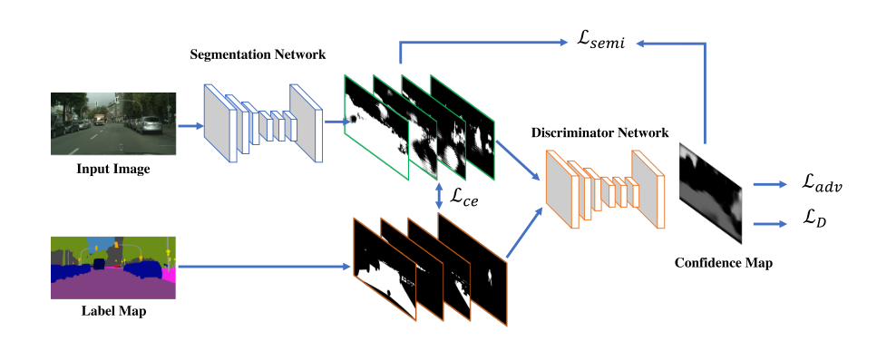

# ENCNet_paddle


## 1 简介
  
本项目基于paddlepaddle框架复现了AdvSemiSeg半监督语义分割学习算法，基于Deeplabv2在Pascal VOC2012数据集上进行了实验。
**论文：**
- [1] Wei-Chih Hung, Yi-Hsuan Tsai, Yan-Ting Liou, Yen-Yu Lin, and Ming-Hsuan Yang
Proceedings of the British Machine Vision Conference (BMVC), 2018. [Adversarial Learning for Semi-Supervised Semantic Segmentation](https://arxiv.org/abs/1802.07934)

**项目参考：**
- [https://github.com/hfslyc/AdvSemiSeg](https://github.com/hfslyc/AdvSemiSeg)

## 2 复现精度
>在Pascal VOC2012 val数据集的测试效果如下表。

|NetWork |steps|opt|image_size|batch_size|dataset|memory|card|mIou|config|weight|log|
| :---: | :---: | :---: | :---: | :---: | :---: | :---: | :---: | :---: | :---: | :---: | :---: |
|Deeplabv2|20k|SGD|321x321|10|Pascal VOC2012+Aug|16G|1|72.66|[deeplabv2_resnet101_os8_voc_semi_321x321_20k.yml](configs/deeplabv2/deeplabv2_resnet101_os8_voc_semi_321x321_20k.yml)|(链接: https://pan.baidu.com/s/13bG-VGyW4VsD5iw3aJpJsQ 提取码: d3qy 复制这段内容后打开百度网盘手机App，操作更方便哦)|[log](deeplabv2_res101_voc_0.125_20k/train.log)|
注意：默认的配置是**ResNet101+Deeplabv2+VOC2012Aug+1/8Label**
不同于原文的是，采用了PaddleSeg的默认数据增强。若要参考与原文完全一致的训练，可以回退版本到上一个版本(上个版本结果：70.4 miou).

## 3 数据集
[Pascal VOC 2012 + SBD dataset](http://host.robots.ox.ac.uk/pascal/VOC/voc2012/index.html)

- 数据集大小:
    - 训练集: 8829
    - 验证集: 1449

应有的数据集结构：
```
pascalvoc/VOCdevkit/VOC2012
├── Annotations
├── ImageSets
├── JPEGImages
├── __MACOSX
├── SegmentationClass
├── SegmentationClassAug
└── SegmentationObject
```

## 4 环境依赖
- 硬件: Tesla V100 16G * 1

- 框架:
    - PaddlePaddle == 2.2.0
  
    
## 快速开始

### 第一步：克隆本项目
```bash
# clone this repo
git clone git@github.com:CuberrChen/AdvSemiSeg-Paddle.git
cd AdvSemiSeg-Paddle
```

**安装第三方库**
```bash
pip install -r requirements.txt
```


### 第二步：训练模型
单卡训练：
```bash
python train.py --config configs/deeplabv2/deeplabv2_resnet101_os8_voc_semi_321x321_20k.yml --label_ratio 0.125 --num_workers 0 --use_vdl --do_eval --save_interval 1000 --save_dir deeplabv2_res101_voc_0.125_20k
```
注意：通过指定label_ratio开启半监督学习算法。--labeled-ratio 0.125 表示1/8标签率。半监督学习算法默认是AdvSemiSeg。具体可以查看train.py。
多卡训练：
```bash
python -m paddle.distributed.launch --config configs/deeplabv2/deeplabv2_resnet101_os8_voc_semi_321x321_20k.yml --label_ratio 0.125 --num_workers 0 --use_vdl --do_eval --save_interval 1000 --save_dir deeplabv2_res101_voc_0.125_20k
```

### 第三步：测试
deeplabv2_res101_voc_0.125_20k目录下包含已经训练好的模型参数（仓库内没有，需要从上面表格提供的链接先下载）以及对应的日志（train.log）和可视化日志（vdlrecords.1638194689.log）文件。
```bash
python val.py --config configs/deeplabv2/deeplabv2_resnet101_os8_voc_semi_321x321_20k.yml --model_path deeplabv2_res101_voc_0.125_20k/best_model/model.pdparams
```

### 第四步：tipc
安装autolog依赖：见test_tipc/README.md
- 安装autolog
    ```
    git clone https://github.com/LDOUBLEV/AutoLog
    cd AutoLog
    pip3 install -r requirements.txt
    python3 setup.py bdist_wheel
    pip3 install ./dist/auto_log-1.0.0-py3-none-any.whl
    cd ../
    ```
在linux下，进入AdvSemiSeg-Paddle文件夹，运行命令
```bash
bash test_tipc/prepare.sh ./test_tipc/configs/advsemiseg_deeplabv2_res101_humanseg/train_infer_python.txt 'lite_train_lite_infer'
bash test_tipc/test_train_inference_python.sh ./test_tipc/configs/advsemiseg_deeplabv2_res101_humanseg/train_infer_python.txt 'lite_train_lite_infer'
```

注意：项目中test_tipc/output/存放了自动化试结果日志。

## 5 代码结构与说明
**代码结构**
```
├─benchmark
├─configs  
├─contrib
├─data
├─deploy                        
├─images                         
├─deeplabv2_res101_voc_0.125_20k                           
├─paddleseg  
├─semi  
├─slim   
├─tests
├─tools
├─test_tipc                                            
│  export.py                     
│  predict.py                        
│  README.md                                            
│  requirements.txt                      
│  setup.py                   
│  train.py                
│  val.py                       
```
**说明**
1、本项目在Aistudio平台，使用Tesla V100 * 1 训练20K miou达到72.66%。  
2、本项目基于PaddleSeg开发。  

## 6 模型信息

相关信息:

| 信息 | 描述 |
| --- | --- |
| 作者 | xbchen|
| 日期 | 2021年11月 |
| 框架版本 | PaddlePaddle==2.2.0 |
| 应用场景 | 语义分割 |
| 硬件支持 | GPU、CPU |
| 在线体验 | [notebook](https://aistudio.baidu.com/aistudio/projectdetail/2884884?contributionType=1&shared=1)|
